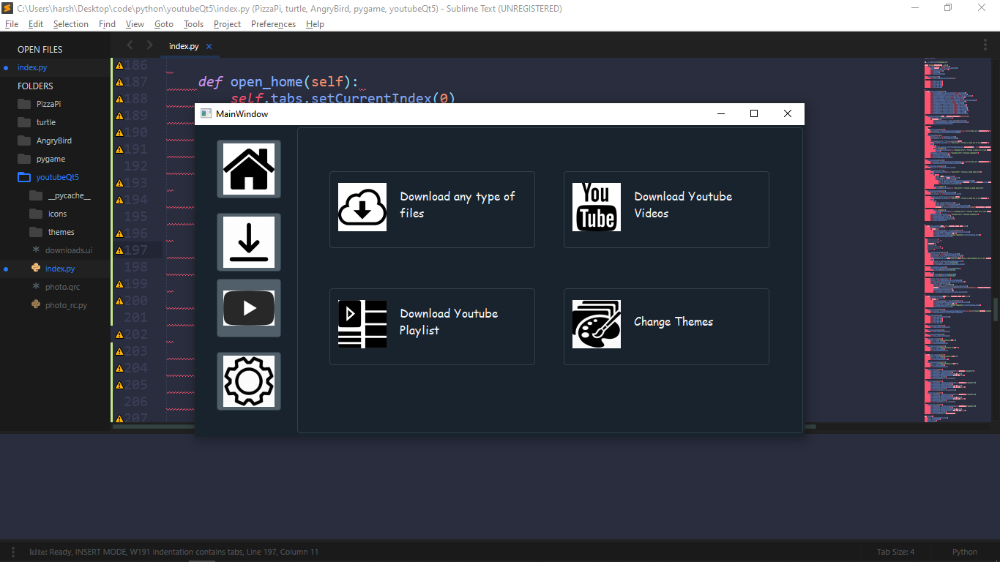

*note: Run the index.py script to get started

# Download-Manager
Download Manager that downloads files , youtube videos &amp; youtube playlists

# Images

Home

Settings
.png)

Download
.png)

Download Youtube Videos
.png)

Download Youtube Playlist
.png)
